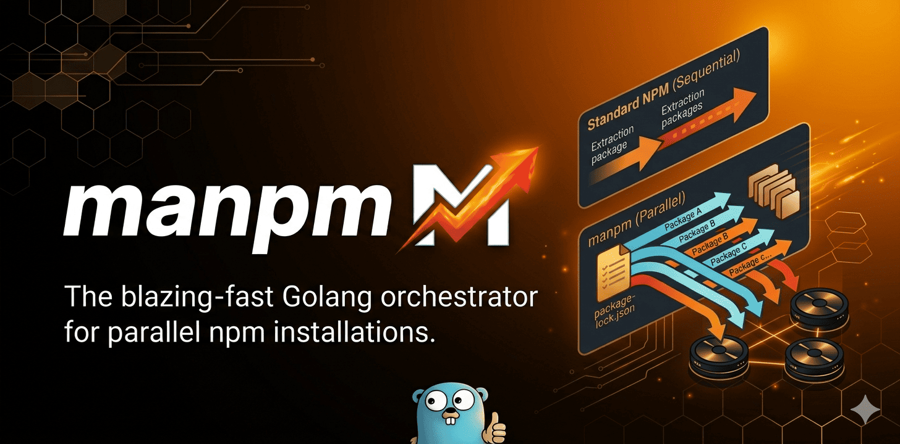

# MaNPM

[](https://github.com/abdou-da0wew/MaNPM/actions/workflows/ci.yml)
[](https://go.dev)
[](https://nodejs.org)
[](LICENSE)



MaNPM is a CLI tool written in Go that parallelizes `npm install`. It reads `package-lock.json`, builds a dependency graph, downloads and extracts tarballs concurrently, verifies SHA512 integrity, orchestrates native module rebuilds, and links `.bin` executables. Zero external dependencies.

## Quick start

```
go install github.com/abdou-da0wew/MaNPM/cmd/manpm@latest
```

Or build from source:

```
git clone https://github.com/abdou-da0wew/MaNPM.git
cd MaNPM
go build -ldflags="-s -w" -o manpm ./cmd/manpm/
```

## Usage

```
manpm install [options]
manpm add <package> [options]
manpm doctor
manpm sensei
manpm audit
manpm pkgjson lock
```

See [Commands](docs/commands.md) for the full reference.

## Documentation

- [Getting Started](docs/getting-started.md)
- [Guide](docs/guide.md)
- [Commands](docs/commands.md)
- [Configuration](docs/configuration.md)
- [Architecture](docs/architecture.md)
- [Development](docs/development.md)
- [Contributing](CONTRIBUTING.md)

## License

MIT
